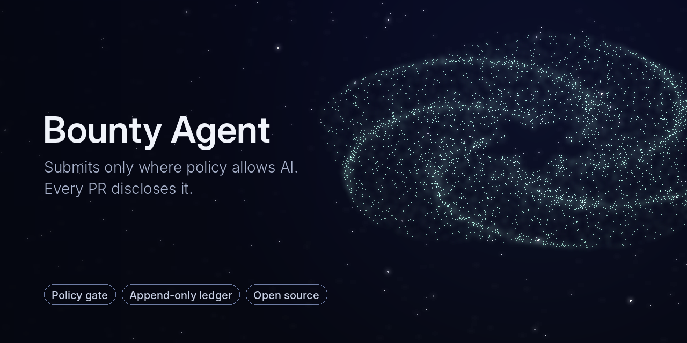

# Bounty Agent — Showcase

An autonomous agent loop that finds real paid open-source work (bounties, grants, paid evaluations), does it, and submits only where the project allows it in writing. This repository is a **showcase**: design, the submission gate and output formats. The agent source is private.

## The rule that comes first

Maintainers are drowning in low-effort AI pull requests. This agent is built the other way round: **it does not submit unless the repository's own written policy allows AI-assisted contributions**, and every PR it opens says so.

| Situation | What the agent does |
|---|---|
| Written policy allows AI / automated contributions | Submits, with an AI disclosure in the PR |
| No written policy | `HOLD_NO_POLICY`, no submission, waits for a human |
| Issue already assigned, or someone else has an open PR | Target is dead, no submission |
| Tests not run on the exact tree being submitted | Blocked |

## Pipeline

```
search (every 1–2 h, 90-day window)
   │  C1 bounties · C2 grants & paid evals · C3 demand for existing work · C4 directly payable tasks
   ▼
triage → structured target record (JSON)
   ▼
work in an isolated branch → tests
   ▼
submission gate  ──►  HOLD / DEAD / BLOCKED   (reason recorded)
   │ pass
   ▼
PR with AI disclosure  →  append-only submission ledger
```

## What the submission gate checks

1. **Tested tree == submitted tree.** The hash of the tree the tests ran on must equal the hash of the tree being pushed.
2. **Policy evidence.** The policy file's SHA and the exact quoted sentence that permits AI contributions are stored with the submission.
3. **Issue snapshot.** SHA of the issue body at decision time, so later edits cannot rewrite why the agent acted.
4. **Policy verdict computed by the gate itself.** The verdict is not taken from the model's claim.
5. **Not already taken.** No assignee, and no other open PR for the issue.
6. **Clean base.** The base branch is an ancestor of the submission (`git merge-base --is-ancestor`).
7. **Intent ledger + lock.** One intent per target, written before acting, and idempotent across retries.

## Output is data, not prose

A task is complete only when it produces a structured record. A short text answer does not count. See [docs/RECORDS.md](docs/RECORDS.md).

## Docs

- [docs/GATE.md](docs/GATE.md): every gate outcome and its reason code
- [docs/RECORDS.md](docs/RECORDS.md): target, intent and submission record shapes

## Rights

See [NOTICE](NOTICE). Documentation shared for review. The agent source is not included and not licensed.
